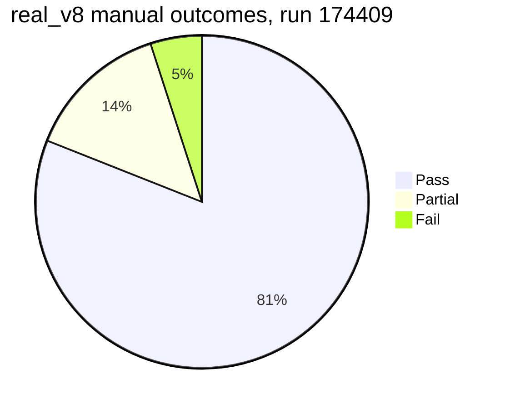
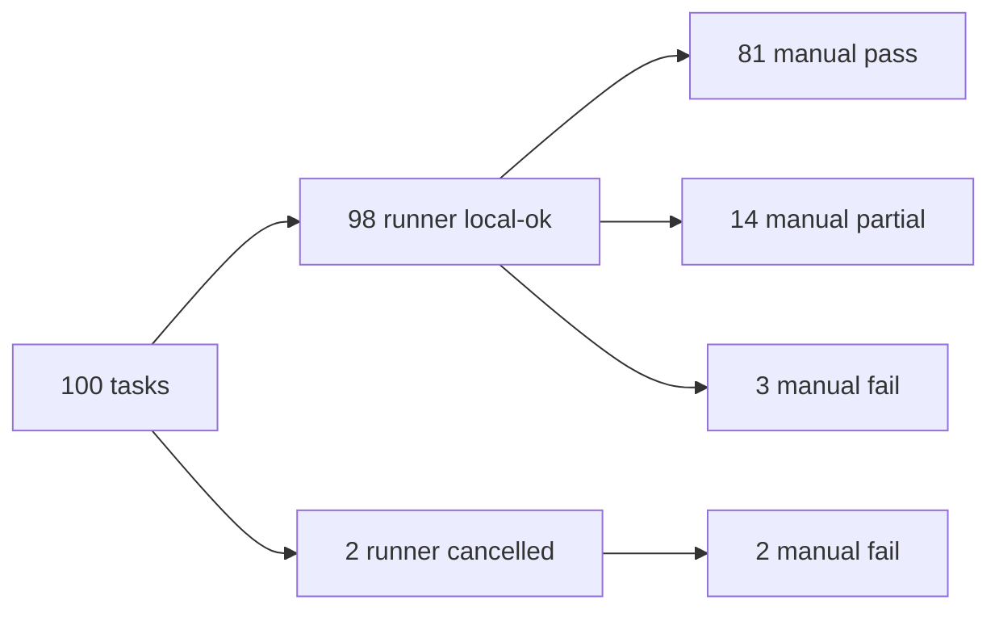

# real_v8 Codex Cloud Eval Report

Run date: 2026-05-13
Run ID: `real-v8-codex-cloud-20260513-174409`
Dataset: `real_v8`
Model/provider: `gpt-5.5` via Codex login
Browser mode: Browser Use cloud only
Concurrency: 25
Manual judging: 5 subagents, 20 tasks each

Artifacts:

- Manifest: `/tmp/real-v8-codex-cloud-20260513-174409/state/dataset-runs/real-v8-codex-cloud-20260513-174409.json`
- Run files: `/tmp/real-v8-codex-cloud-20260513-174409/state/dataset-run-files/real-v8-codex-cloud-20260513-174409`
- Runner summaries: `/tmp/real-v8-codex-cloud-20260513-174409/run-summary.json`, `/tmp/real-v8-codex-cloud-20260513-174409/dataset-report.json`

## Executive Summary

The runner result was excellent mechanically: **98/100 local-ok**, with no pending tasks.

The stricter manual score is lower because many runner-successful tasks produced incomplete or low-fidelity data:

| View | Pass | Partial | Fail | Score |
|---|---:|---:|---:|---:|
| Runner manifest | 98 | n/a | 2 | 98% |
| Manual strict | 81 | 14 | 5 | 81% |
| Manual half-credit | 81 | 14 | 5 | 88% |

```text
Manual outcomes

Pass     81 | ##################################################
Partial  14 | #########
Fail      5 | ###
```



Compared with the prior cloud run report (`real-v8-codex-cloud-20260513-112315`):

| Metric | Previous | Current | Delta |
|---|---:|---:|---:|
| Runner local-ok | 93 | 98 | +5 |
| Runner pending | 1 | 0 | -1 |
| Manual strict | 86 | 81 | -5 |
| Manual half-credit | 88 | 88 | 0 |
| Hard manual fails | 10 | 5 | -5 |
| Manual partials | 4 | 14 | +10 |

The important read: the branch improved infrastructure and converted several old hard failures into passes or partials. The strict score dropped because this judging pass was more granular and counted low-quality "technically completed" outputs as partial instead of pass.

## Run Hygiene

This eval was run in cloud browser mode:

```bash
./target/debug/browser-use-terminal \
  --state-dir "$STATE_DIR" \
  dataset-run-codex real_v8 \
  --all \
  --model gpt-5.5 \
  --max-turns 80 \
  --python-timeout-seconds 180 \
  --max-attempts 2 \
  --concurrency 25 \
  --browser-mode cloud \
  --run-id real-v8-codex-cloud-20260513-174409
```

The run used cloud browser config and did not require local Chrome. After judging, stale `but-managed-chrome.*` local Chrome processes from earlier work were found and killed separately so they cannot keep producing remote-debug prompts. Those stale processes were not part of this cloud eval.

## Non-Pass Tasks

### Hard Fails

| Task | Failure mode | What happened | Priority fix |
|---:|---|---|---|
| 9 | Empty extraction | Returned `{"properties":[]}` for HostGenius without extracting listings or proving no public listings exist. | Add empty-result validator requiring either records or an evidence-backed no-public-listings explanation. |
| 21 | Date picker not applied | Booking task returned all-null hotel rates while the site was still asking for dates. | Add date-entry validation: do not accept all-null rates unless the page visibly confirms sold out/unavailable for each date. |
| 41 | Cancelled incomplete pagination | Didacta run was cancelled and artifact had only 400 of roughly 710 exhibitors. | Use official pagination/API offsets directly; persist incremental pages and stop only after final page. |
| 72 | Missing required value | ND DMR task reported operator ID as unknown. | Find the operator/organization endpoint or list backing the public UI and require the exact ID before finalizing. |
| 75 | Cancelled no output | Dallas plastic surgeon extraction was cancelled with no result file. | Persist surgeon rows incrementally before award-list searching; add timeout salvage and resume. |

### Partials

| Task | Failure mode | What was missing | Priority fix |
|---:|---|---|---|
| 5 | Dynamic product parse errors | Some prices were impossible placeholders and CTAs were treated as availability. | Validate displayed price text against product JSON and null out non-price cards. |
| 27 | Provider parsing error | Some Danish telecom rows used icon alt text like `4G forbindelse ikon` as provider. | Exclude network icons and validate provider names against visible carrier text. |
| 38 | Provider/package parsing error | Samlino mobile rows confused carrier names, promo copy, and network icons. | Use stable card fields for provider and package title, not image alt text. |
| 46 | Missing normalization | Alcom contract length was `Not specified`, outside the expected normalized values. | Inspect plan terms/FAQ and normalize binding period to allowed labels. |
| 52 | Incomplete final list | Carbon Pulse trace found 37 dated items but final Markdown listed 24. | Use the full extracted dated list and apply explicit article/non-article filtering before final. |
| 59 | Missing/ambiguous emails | HVAC Austin had no email and Luv Braces used ambiguous/non-Austin emails. | Add email validation and per-business not-found evidence. |
| 65 | Article entity quality | TechCrunch result included promos/non-startups and missing websites. | Extract the primary company from each latest article only when article semantics support it. |
| 66 | Incomplete property matches | Volusia search found address/value for 5 of 11 people. | Search broader owner-name variants and historical/current records; avoid overly strict exact owner filtering. |
| 68 | Incomplete email discovery | Seven contacts were not found and one email looked syntactically invalid. | Validate syntax/domain and distinguish verified owner/contact emails from generic results. |
| 87 | Count met, weak fields | 200 rows were returned, but only 7 came from SydneyFoodTrucks and website/social/owner fields were blank. | Scrape individual listing pages and social links before supplementing from council data. |
| 88 | Specialty targets not met | Surgeon dataset had 405 rows but several specialties were below 40 and geography drifted. | Add per-specialty counters and source constraints before finalizing. |
| 94 | Contact person details missing | WCA Hong Kong companies were scraped, but contact names were blank and emails sparse. | Open profile/contact sections and record visible not-found evidence per field. |
| 96 | Required fields missing | BuiltFirst AppDirect entries lacked website URLs and categories. | Follow visit buttons/metadata for AppDirect records before final. |
| 100 | Product field quality low | Kaufland images were mostly wrong, one row name was `Bestseller`, and Galaxus ratings were all null. | Re-scrape cards with platform-specific selectors and validate names/images before output. |

## Main Failure Modes

| Category | Tasks | Count | Why it matters |
|---|---|---:|---|
| Empty or unsupported final extraction | 9, 21, 72 | 3 | The model stopped without proving the required data was absent or found. |
| Long-running directory tasks cancelled | 41, 75 | 2 | The scheduler/run did not finish enough extraction before cancellation. |
| Field-level data quality | 5, 27, 38, 46, 59, 68, 94, 96, 100 | 9 | Row counts can look good while specific requested fields are wrong or missing. |
| Incomplete collection against a known target | 52, 66, 87, 88 | 4 | The answer is useful but does not satisfy the requested completeness threshold. |
| Finalization contract smell | 17 | 1 | Task 17 passed because the artifact was good, but the manifest final answer was only `Done.`. |



## Why This Happened

### 1. Runner `ok` still measures completion, not answer quality

The manifest only knows that a session ended and produced a final result. It does not know if all requested fields were populated, whether dates were actually applied, or whether the output met a count target. That is why the runner can say 98/100 while the manual strict score is 81/100.

### 2. Some tasks need validators before final answer

Several failures were detectable before judging:

- Task 9 returned an empty property list.
- Task 21 returned all null prices.
- Task 41 returned 400 exhibitors when the prompt said around 710.
- Task 52 returned 24 items after finding 37 dated items.
- Task 88 did not reach 40 candidates for multiple specialties.
- Task 100 had a product named `Bestseller`.

These should trigger a repair loop before the task can end.

### 3. Long directory tasks need incremental persistence and resume

Tasks 41 and 75 are not primarily reasoning failures. They are long extraction workflows where progress needs to be persisted continuously and the run needs timeout/resume behavior. Task 41 already had 400 usable rows, but no final answer because it was cancelled.

### 4. The final-answer/artifact contract is still too loose

Task 17 had a correct `outputs/result.json`, but the final answer shown in the manifest was `Done.`. Manual artifact-aware judging passed it, but a benchmark consumer looking only at final text would not.

The runtime should replace placeholder free-text finals with the persisted final answer artifact, not only on the explicit `done` tool path.

### 5. The remaining misses are mostly high-fidelity extraction, not basic browsing

The branch now gets through many difficult sites, downloads, PDFs, and large APIs. The remaining gap is mostly:

- verifying completeness,
- validating field semantics,
- using stable selectors instead of visible incidental text,
- knowing when a site has hidden/API-backed data,
- avoiding premature final answers on sparse data.

## Path To Above 90

Strict score is currently 81. To exceed 90 strict, we need roughly 10 more tasks to move from fail/partial to pass.

The highest-leverage path is:

| Rank | Fix | Target tasks | Expected strict gain |
|---:|---|---|---:|
| 1 | Add dataset validators plus repair loop | 9, 21, 46, 52, 72, 88, 96, 100 | +4 to +7 |
| 2 | Add incremental persistence, timeout salvage, and resume for long tasks | 41, 75 | +1 to +2 |
| 3 | Add stable card/parser rules for telecom/product grids | 5, 27, 38, 100 | +2 to +4 |
| 4 | Add contact/email verification workflow | 59, 68, 94, 96 | +1 to +3 |
| 5 | Add playbooks for county portals and constrained directories | 66, 87, 88 | +1 to +3 |

Expected next target after these changes:

- Conservative: **88-90 strict**, **91-93 half-credit**
- Realistic if validators trigger retries well: **90-93 strict**
- Stretch with domain playbooks: **93-95 strict**

Going materially above 93 is blocked less by browser infra and more by source/data ambiguity:

- Some tasks request owner/contact/person details that may not be visible on the source site.
- Some retail/search pages expose noisy dynamic cards that need site-specific selectors.
- Large directory tasks need exact completeness guarantees, not just many rows.
- Some portals have multiple similarly named records and require careful search broadening without hallucinating matches.

## Recommended Implementation Plan

### P0: Quality gate before `session.done`

Add a dataset-mode quality check that rejects or repairs:

- placeholder finals like `Done.`,
- empty arrays for required extraction tasks,
- all-null key fields,
- output counts below explicit prompt thresholds,
- `unknown` for an explicitly requested ID,
- rows where required field values are obvious UI labels, icons, or CTAs.

This should not ban `Done.` globally. It should only make `Done.` insufficient for dataset success unless a valid artifact is present and declared.

### P0: Artifact-aware finalization

Route free-text completion through the same finalization helper as the `done` tool:

1. If `.final_answer.json` exists and the assistant text is placeholder, replace the final result with the persisted final answer.
2. If `outputs/result.json` exists, final text should include path, record count, and one sample row.
3. If neither exists and the answer is placeholder, continue the agent with a corrective message.

This fixes the task 17 class without restricting the model too much.

### P1: Validators by task shape

Add lightweight validators inferred from the prompt:

- `minimum_count`: detects "at least 150", "around 710", "40 candidates per specialty", "top 20".
- `required_value`: detects "return the ID", "download the PDF", "property URLs and names".
- `required_fields`: detects repeated schema fields and verifies non-empty values.
- `date_applied`: detects hotel/event/date tasks where all rates or availability are null.
- `field_semantics`: rejects values like `Bestseller`, `READ MORE`, `4G forbindelse ikon`, impossible placeholder prices.

The validator should produce a model-visible repair prompt instead of deterministic hardcoding.

### P1: Long-task runner hardening

Add per-task wall-clock timeout, idle heartbeat, and result salvage:

- Save active task state with session ID and paths.
- Use `recv_timeout` instead of an indefinite receive.
- On timeout, stop the session and inspect `outputs/`.
- If a valid partial output exists, record it as `runner_status: salvaged_partial`.
- If a valid complete output exists, record it as `runner_status: salvaged`.
- Otherwise fail cleanly instead of requiring manual cancellation.

### P2: Domain playbooks

Add prompt/tool guidance, not deterministic task-specific code:

- For listing pages: discover API/network endpoints, count pages, persist after each page.
- For date pickers: verify the selected date text is visible before extracting prices.
- For county/property portals: search exact, then normalized, then broader variants; report not-found evidence per person.
- For contacts: validate email syntax/domain and classify generic vs person-specific.
- For product grids: prefer structured card data/selectors over visible incidental labels.

## Current Score Interpretation

The best single-number read is:

- **98/100 runner health**
- **81/100 strict manual quality**
- **88/100 half-credit quality**

For product direction, I would optimize against strict manual quality. For regression tracking, I would track all three. The raw runner score is useful for infra health, but it is too optimistic for benchmark quality.

