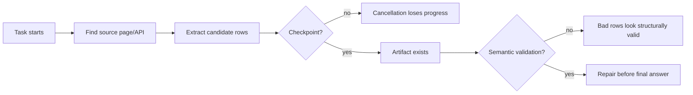
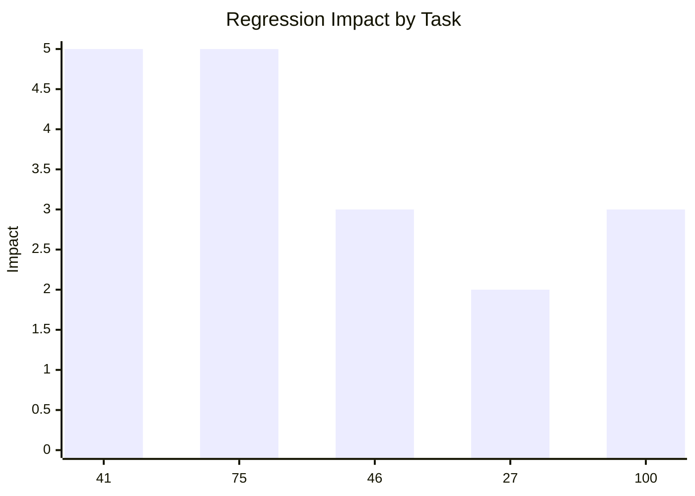

# real_v8 Regression Root Cause Deep Dive

Compared runs:

- Previous run: `real-v8-codex-cloud-20260513-112315`
- Current run: `real-v8-codex-cloud-20260513-174409`
- Previous artifacts: `/tmp/real-v8-codex-cloud-20260513-112315`
- Current artifacts: `/tmp/real-v8-codex-cloud-20260513-174409`
- Current report: `docs/real-v8-codex-cloud-run-20260513-174409-report.md`
- Head-to-head summary: `docs/real-v8-head-to-head-112315-vs-174409.md`

## Short Answer

The current run is not simply "worse". The runner score stayed high, and some current artifacts are better than the previous run. The strict manual score dropped because a handful of tasks regressed in ways that are easy to see once we inspect the artifacts and trace events.

The real regressions are concentrated in five tasks:

| Task | Previous result | Current result | First-principles failure |
|---:|---|---|---|
| 41 | 727 exhibitors saved | 400 exhibitors saved, run cancelled | Long extraction had partial data, but recovery work was inside one slow browser/Python call with no checkpoint |
| 75 | 178 surgeon rows saved | No output, run cancelled | Agent reached enough rows, kept searching, then lost in-memory progress on cancellation |
| 46 | Contract length normalized to `No binding` | Every package says `Not specified` | Agent stopped at visible cards and did not inspect terms/PDF source |
| 27 | 103 mostly clean mobile rows | 102 rows, 4 providers are `4G forbindelse ikon` | Parser trusted decorative image alt text as provider |
| 100 | Kaufland product images mostly valid | 17 bad Kaufland images, one product named `Bestseller` | Parser trusted first card image/text instead of product-specific image/title nodes |

This is the core pattern: the model often gets the page open and extracts something plausible, but the harness does not force durable progress, source-depth checks, or semantic artifact validation before accepting the result.



## What Changed Between Runs

The previous run did not outperform the current run everywhere. Some previous successes were only "successful" under a looser read of the output, and several current outputs are cleaner.

The regressions are mostly explained by stochastic execution choices:

- In task 41, both runs hit the same Didacta pagination problem at offset 400. The previous run recovered with a more robust/concurrent strategy. The current run started recovering but was cancelled during a slow browser-driven recovery loop.
- In task 75, the current run already had enough surgeons to satisfy the task, but kept doing optional research before saving. The previous run saved a complete artifact.
- In tasks 27, 46, and 100, the current run chose shallower or weaker extraction heuristics than the previous run.

There is no strong evidence that the browser connection itself caused tasks 27, 46, or 100 to fail. For tasks 41 and 75, remote/browser latency may have made long page-by-page loops more likely to get cancelled, but the real bug is that progress was not written incrementally and the runner did not salvage/retry partial work.

## Regression Severity



Impact scale:

- `5`: direct full-task loss or large missing artifact.
- `3`: artifact exists but an important field family is wrong.
- `2`: mostly valid artifact with localized bad rows.

## Task 41: Didacta Exhibitors

### Symptom

Previous run saved 727 exhibitors:

```bash
jq 'length' /tmp/real-v8-codex-cloud-20260513-112315/state/dataset-run-files/real-v8-codex-cloud-20260513-112315/task-41-attempt-1/outputs/result.json
# 727
```

Current run saved only 400 exhibitors:

```bash
jq 'length' /tmp/real-v8-codex-cloud-20260513-174409/state/dataset-run-files/real-v8-codex-cloud-20260513-174409/task-41-attempt-1/outputs/result.json
# 400
```

### What Actually Happened

Both runs initially discovered the same site behavior:

- Pages at offsets `0..380` returned rows.
- Offset `400` returned zero rows through the naive request/fetch path.
- The visible pagination still exposed links beyond 400, up to the expected full result set.

The previous run did not magically avoid this. It hit the same wall, then recovered by inspecting pagination links and using a more robust flow. Later snippets used direct requests with retries/browser state and then fetched detail pages concurrently. It eventually wrote 727 records and called `done`.

The current run also recognized the problem and started a recovery path. The difference is that the current recovery path became a long browser DOM pagination loop:

- Navigate to each page through CDP/browser.
- Sleep per page.
- Evaluate DOM for exhibitor links.
- Then fetch details.

That long tool call was cancelled before responding. The manifest therefore saw only the earlier partial artifact with 400 rows.

### First-Principles Cause

This is not primarily a reasoning failure. It is a durability failure.

The agent had useful data and understood the issue, but the work was structured as one long in-memory operation. Once the process was cancelled, the recovered pages and detail work were lost.

The root causes in the current codebase/harness are:

- No requirement to checkpoint extraction progress per page.
- No heartbeat/progress contract for long-running tool calls.
- No salvage path that marks a partial artifact as incomplete and retries.
- No task-aware validation that "expected around 710" and "got 400" means repair/retry before final scoring.

### Fix

Generic, not task-specific:

1. Add a prompt/runtime rule: for multi-page extraction, write `outputs/result.json` after every page or every N records.
2. Add a runner-side partial-artifact policy: if an attempt is cancelled but output exists and is below an expected count, retry with the existing artifact as context.
3. Add a progress heartbeat around long browser/Python operations so cancellation can distinguish "hung" from "still making progress".
4. Add validation prompts for count hints: if prompt says "around 710" and artifact has 400, do not treat that as complete.

## Task 75: ASPS Dallas Surgeons

### Symptom

Previous run saved 178 surgeon rows:

```bash
jq '.surgeons | length' /tmp/real-v8-codex-cloud-20260513-112315/state/dataset-run-files/real-v8-codex-cloud-20260513-112315/task-75-attempt-1/outputs/result.json
# 178
```

Current run saved no output files for task 75.

### What Actually Happened

The current trace shows the agent extracted pages 1 through 15 and reached 154 surgeon rows. That already satisfied the task's "at least 150 surgeons" requirement.

Instead of immediately writing the artifact and finishing, the agent continued:

- It searched for award/selection recipient lists.
- It investigated alternate ASPS endpoints and search IDs.
- It started another long page loop from page 16 onward.

That last loop was cancelled before it returned. Because the 154 rows lived only in memory, the output directory stayed empty.

### First-Principles Cause

This is an "overshoot without checkpoint" failure.

The agent satisfied the minimum requirement, but kept optimizing for a larger/better result without first preserving the acceptable result. The harness allowed a task that was effectively passable to become a full failure.

The root causes are:

- No "save as soon as minimum viable artifact exists" rule.
- No incremental file writes during long extraction.
- No runner salvage when a cancelled attempt has useful in-memory trace evidence but no artifact.
- No prompt guidance to separate required data from optional enrichment.

### Fix

Generic:

1. Prompt the agent to save immediately once a minimum requested count is reached.
2. When doing optional enrichment, keep updating the same artifact rather than holding enrichment in memory.
3. Add retry context: if an attempt is cancelled after logs show `total >= target`, the retry prompt should say "you already reached the target; reconstruct/save the artifact first."

This is one of the highest-impact fixes because it converts cancellations from zero-output failures into partial or full successes.

## Task 46: Telia Mobile Broadband Contract Length

### Symptom

Previous run normalized every contract length to `No binding`.

Current run wrote five packages, all with `Contract length: "Not specified"`:

```json
{
  "Provider": "Alcom",
  "Package name": "1 GB Aland",
  "Contract length": "Not specified"
}
```

### What Actually Happened

The previous run did extra source discovery:

- It extracted visible pricing cards.
- It searched the page/source for contract-related terms.
- It followed price-list and terms links.
- It inspected/downloaded the relevant mobile broadband terms PDF.
- It normalized the contract term to `No binding`.

The current run stopped after visible card extraction. Since the cards did not show contract length, it filled `Not specified`.

### First-Principles Cause

This is a source-depth failure.

The visible pricing card is not the authoritative source for all requested fields. Contract length is often in terms, price lists, PDFs, or FAQ pages. The current agent treated absence on the card as absence in the source.

The root causes are:

- No prompt rule saying requested fields absent from cards must be looked up in terms/FAQ/PDF pages.
- No validator that flags `Not specified` for high-value fields unless the agent records evidence that it searched authoritative terms.
- No artifact field provenance. The artifact does not say whether `Not specified` means "not shown on card" or "not found after checking terms."

### Fix

Generic:

1. Add source-depth prompting for plan/comparison tasks: if a requested field is missing from the product card, inspect terms, FAQ, PDF, or linked legal pages before using `Not specified`.
2. Add a soft validator: repeated `Not specified` across all rows for a requested field should trigger a repair pass.
3. Encourage evidence notes for unknown fields: "checked visible cards, FAQ, terms PDF; no contract length found."

This should not be implemented as a Telia-specific rule. The generic rule is that "missing visible text" is not enough evidence for an unknown value.

## Task 27: Samlino Mobile Providers

### Symptom

Current artifact has four rows where the provider is the decorative network icon alt text:

```text
4G forbindelse ikon    4G forbindelse ikon mobil 20 GB data
4G forbindelse ikon    4G forbindelse ikon mobil 50 GB data
4G forbindelse ikon    4G forbindelse ikon mobil 150 GB data
4G forbindelse ikon    4G forbindelse ikon mobil 6 GB data
```

### What Actually Happened

The current scraper selected provider names from image `alt` text. It filtered out `5G forbindelse ikon`, `Trustpilot logo`, and `Udbyder logo`, but not `4G forbindelse ikon`.

So for 4G cards, the first acceptable image alt became the provider. The package name then inherited that wrong provider too.

### First-Principles Cause

This is a DOM semantics failure.

The extractor treated all image alt text as equivalent. But in a product card, there are different image classes:

- Product/provider logo.
- Network icon.
- Trust/rating logo.
- Decorative UI icon.

The model made a local blacklist instead of selecting the semantically correct node.

The root causes are:

- No generic artifact validator for field plausibility.
- No rule that provider/company names should not contain UI words like `icon`, `logo`, `forbindelse`, `rating`, or network labels.
- No cross-field validation: provider and package name both containing the same decorative text should be suspicious.

### Fix

Generic:

1. Add field-level artifact validation for entity/name fields:
   - reject obvious UI labels such as icon/logo/badge/rating/read more/filter/sort.
   - reject network/status labels as providers.
2. Prompt extraction to prefer explicit product/provider logo containers or nearby link/card metadata over arbitrary `img.alt`.
3. Add a repair pass if entity names include UI vocabulary.

This is not a hardcoded Samlino fix. It is a generic "do not use decorative UI text as data entity" rule.

## Task 100: Marketplace Supplement Listings

### Symptom

Current Kaufland output has:

- 20 rows.
- 17 rows with null, wishlist icon, static icon, or otherwise non-product image URLs.
- One row where product name is `Bestseller`.

Example:

```json
{
  "platform": "kaufland.de",
  "rank": 7,
  "name": "Bestseller",
  "image_url": "https://static.cdn.kaufland.de/static/common/dist/img/wishlist/wishlist-icon.svg",
  "average_rating": 4.5,
  "number_of_reviews": 28
}
```

### What Actually Happened

The current agent successfully got the Kaufland page loaded. The raw card extraction had real product cards available.

The final parser then made two weak choices:

- It chose the first text line that did not match a small skip list. The skip list omitted badges like `Bestseller`, so a badge became a product name.
- It used `card.querySelector('img')`, which often returns the first image in the card. On Kaufland this can be wishlist/static UI imagery, not the product image.

### First-Principles Cause

This is another DOM semantics failure.

The page contained product data, but the parser did not distinguish product content from card chrome. The output shape was valid JSON, so it passed structural checks, but semantically it was wrong.

The root causes are:

- No validation that product names are not badges.
- No validation that image URLs look like product images.
- No repair loop when a marketplace has many null/static/icon images.
- No selector strategy that prefers product image nodes or product CDN URLs over first image.

### Fix

Generic:

1. Add artifact validation for ecommerce rows:
   - product names cannot be badges or action labels.
   - image URLs should be product CDN/content URLs, not wishlist/static/icon/data URI assets.
   - if more than a small fraction of images are bad, rerun extraction with better selectors.
2. Prompt the agent to inspect card structure before final extraction:
   - product link/title/aria-label for name.
   - product image `src/srcset` matching product CDN/content path for image.
3. Keep this generic across marketplaces. Do not hardcode Kaufland beyond using selectors discovered during the run.

## Non-Regressions That Still Matter

These tasks also failed or were weak, but they were not clearly "succeeded before and failed now":

| Task | Pattern | Why it matters |
|---:|---|---|
| 9 | Previous was also bad/wrong-source; current became empty | Need empty-result validation and better source verification |
| 21 | Booking rates all/null in both runs | Need date/filter state validation before accepting hotel-rate outputs |
| 5 | `READ MORE`/placeholder leakage in both runs | Need UI-label filtering and price field validation |
| 65 | Non-startup/company classification issues in both runs | Need entity classification/provenance checks |
| 94/96 | Partial extraction in both runs | Need count/progress validation and incremental checkpoints |

These are still good improvement targets, but they do not explain why the current run looked worse than the previous run.

## Why "Done" and False Success Can Happen

The runner primarily knows whether the agent finished and whether an artifact/output exists. It does not deeply understand that:

- `Done` is not a useful final answer.
- 400 rows is bad if the prompt expected around 710.
- A provider named `4G forbindelse ikon` is not a provider.
- A product named `Bestseller` is a badge.
- `Not specified` across every contract field is suspicious if the source has terms pages.

So a task can look operationally successful while being semantically wrong. The inverse also happens: a task can be nearly solved in trace state, but if the process is cancelled before writing the file, it becomes a hard failure.

## Priority Fix List

| Priority | Fix | Expected impact | Why |
|---|---|---:|---|
| P0 | Incremental artifact checkpointing for extraction tasks | Very high | Converts task 41/75-style cancellations into recoverable partial/full outputs |
| P0 | Minimum-target save rule | Very high | Prevents task 75 from going from passable to zero-output |
| P0 | Artifact semantic validator + repair prompt | High | Catches task 27/100/5-style UI text and icon leakage |
| P1 | Source-depth prompt for missing requested fields | Medium-high | Catches task 46-style `Not specified` misuse |
| P1 | Count-hint validation | Medium-high | Catches "around 710 but got 400" cases |
| P1 | Retry cancelled attempts with artifact/trace summary | Medium | Helps long tasks resume instead of starting over |
| P2 | Structured provenance notes for unknown fields | Medium | Makes judging and repair more reliable without hardcoding answers |

## Implementation Shape I Would Use

Keep it generic. Avoid task-specific deterministic rules.

### Prompt/runtime additions

Add guidance along these lines:

- For multi-page extraction, save `outputs/result.json` incrementally as soon as rows are available.
- If the user gives a target count or approximate count, compare the artifact count against it before finishing.
- Once the minimum requested count is reached, save the artifact before doing optional enrichment.
- If using a remote browser, remember browser-side files are on another machine; download/upload artifacts through CDP or local tool mechanisms as needed.
- If a requested field is missing from visible cards, inspect authoritative linked details, terms, PDFs, FAQ, or source APIs before writing `Not specified`.
- Before final answer, scan output for UI labels/badges/icons accidentally used as entity names or product data.

### Harness/runner additions

Add a lightweight artifact validation/repair step:

1. Detect output files.
2. Summarize schema and suspicious values.
3. Feed the summary back to the agent before `done` if suspicious values are present.

Suspicious generic signals:

- Entity/name fields containing `icon`, `logo`, `read more`, `filter`, `sort`, `wishlist`, `badge`, `bestseller`, `sponsored`, or similar UI terms.
- Image URL fields pointing at static icons, wishlist assets, SVG UI assets, or data URIs.
- Repeated `Not specified`/null across all rows for a requested high-value field.
- Count materially below prompt target or obvious pagination count.
- Empty output when trace logs show extracted rows existed.

### Runner cancellation/retry additions

When an attempt is cancelled:

1. Check whether any output artifact exists.
2. If it exists, validate it and decide whether to retry from partial.
3. If no artifact exists, inspect recent trace summaries for extracted counts and tell retry agent what was already found.
4. Prefer retrying with "save artifact first, then continue" instruction.

## Expected Score Upside

The fixes above directly address the real regressions:

- Task 41 likely becomes at least partial credit and often full credit.
- Task 75 likely becomes full credit because the run already reached the requested count.
- Task 46 likely becomes full credit or near-full if the agent does one source-depth pass.
- Task 27 likely becomes full credit with semantic validation/repair.
- Task 100 likely improves from partial to near-full if bad image/name rows trigger repair.

Conservatively, these changes should push strict manual score back above 90 if they work as intended. Getting materially above 93 is harder because the remaining failures are less uniform: they need stronger source verification, domain judgment, and task-specific reasoning without overfitting the benchmark.

## Bottom Line

The current branch is not fundamentally broken. The failures are mostly places where a good browser agent needs guardrails around durability and artifact quality:

- Save progress early and often.
- Treat cancellation as recoverable.
- Validate data semantically, not only structurally.
- Require deeper source checks before filling unknowns.

Those are general agent-quality improvements, not benchmark hacks.
